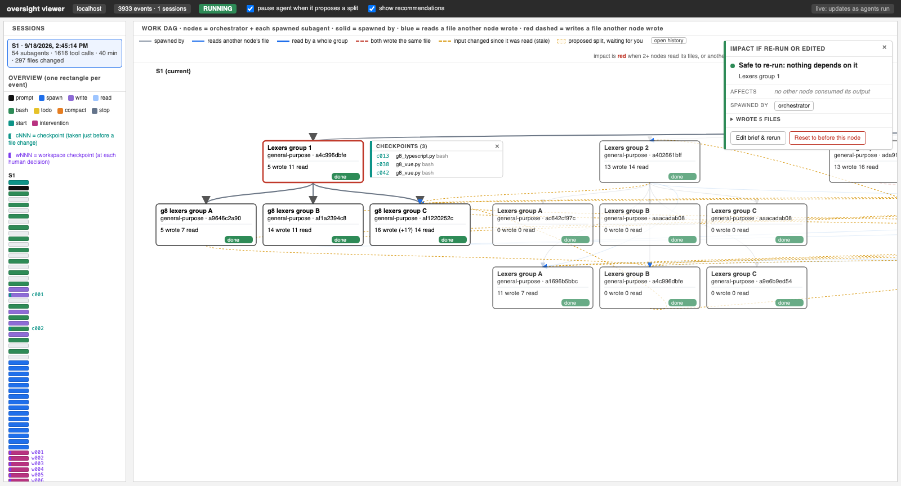

# multi-agent-oversight

An open-source tool for **watching and steering multi-agent Claude Code runs as they happen**.
It records every step an agent and its subagents take, draws the work as a live DAG, tells you
what a change to one node would affect downstream, and lets a human pause, accept, modify,
reject, reset, or rerun parts of the work, from a browser or a terminal.



*A live run: the overview strip (left, one rectangle per event, with checkpoint ids), the work DAG
(orchestrator plus each spawned subagent, with data and conflict edges), a selected node's
checkpoints, and its impact card.*

> Research prototype. It is used in an HCI study on human oversight of coding agents. The tested
> setup is a ProgramBench task run in Claude Code on macOS (details below).

## What it does

- **Recorder.** Claude Code hooks append every event to `oversight/events.jsonl`: prompts, each
  tool call with timing, subagent start and stop, the full brief each subagent was spawned with,
  files read and written (including files a Bash command reads or writes), and content hashes of
  every version read and produced.
- **Work DAG.** One node for the orchestrator and one per spawned subagent. Edges: spawned by;
  *reads another node's file* (Y read the exact version X wrote); *both wrote the same file*;
  *input changed since it was read* (stale). It updates live as agents run.
- **Impact notice.** For any node, a causal walk over those edges lists every node that consumed
  its output, each with a one-line reason. The node turns red when **2 or more downstream nodes
  read its files, or another session wrote the same file**; otherwise it is "safe to re-run".
- **Checkpoints.**
  - `cNNN` file checkpoints: before every file change (Write, Edit, or a Bash command that writes
    a file) the file's current content is saved to a content-addressed store.
  - `wNNN` workspace checkpoints: created at every human decision (before each split decision,
    before and after every reset and every edit-and-rerun).
  - Resetting to any checkpoint (or to `node:<name>`, or `t<seconds>`) restores the workspace
    files byte-identically, and every reset can be undone.
- **Split gate.** Optionally pauses every proposed subagent spawn until a human decides:
  Accept, Accept all from this parent, Modify, Reject, or Reset. The card shows the impact of the
  split, and optionally rule-based pros and cons.
- **Interventions.** Reset to a checkpoint; edit a node's brief and rerun it; send an instruction
  to one running agent. Each shows a preview first, and every decision is logged with its
  before and after checkpoints (`oversight/control/interventions.jsonl`).
- **Terminal version.** `oversight/ctl.py` does everything the viewer's buttons do.

Not implemented yet: restoring an agent's conversation state at a checkpoint (only files are
restored), model-based recommendations, and a generic installer for arbitrary projects.

## Quick start (ProgramBench task in Claude Code)

Requirements: macOS or Linux, [Docker](https://www.docker.com/) running (Apple Silicon: enable
Rosetta for amd64 emulation in Docker Desktop), [Claude Code](https://claude.com/claude-code),
python3.

```bash
git clone https://github.com/Saumya-Chauhan-MHC/multi-agent-oversight.git
cd multi-agent-oversight
GATE=on CAP_MINUTES=45 ./setup.sh alecthomas__chroma.8d04def   # pulls the task image, builds ./task
```

Then, in two terminals:

```bash
cd task && python3 oversight/viewer/serve.py     # viewer at http://localhost:4173
./run_interactive.sh                             # starts Claude Code on the task prompt
```

With `GATE=on` the agent pauses at every proposed subagent spawn until you decide in the viewer
(or with `python3 oversight/ctl.py watch`). Claude Code will ask permission for Bash commands;
allow them, or pre-allow Bash for this folder only in `task/.claude/settings.local.json`.

Setup options (environment variables): `GATE=on|off` (split gate), `RECOMMEND=on|off` (pros and
cons on split cards), `CAP_MINUTES` (session time cap), `PB_CONTAINER` (name of the reference
container, default `pb_ref`, so two setups can run side by side).

## Terminal control

Run from `task/`:

```text
python3 oversight/ctl.py status                  run state, gate mode, pending splits
python3 oversight/ctl.py gate on|off             pause every proposed subagent spawn for review
python3 oversight/ctl.py watch                   wait for proposed splits and decide them here
python3 oversight/ctl.py nodes                   node ids, intents, status
python3 oversight/ctl.py checkpoints             checkpoints you can reset to
python3 oversight/ctl.py reset <cp>              reset to a checkpoint
python3 oversight/ctl.py edit <node> --brief T   edit a node's brief and rerun it
python3 oversight/ctl.py tell <node> "<text>"    instruction to a running node
python3 oversight/ctl.py undo <backup-id>        reverse a reset or edit
python3 oversight/ctl.py history                 every recorded intervention
```

## Repository layout

```text
setup.sh             one-time setup for one ProgramBench task instance (creates ./task)
run_interactive.sh   launch Claude Code on the prepared task
grade.sh             pack ./task and run the official ProgramBench hidden tests
overlay/             copied into ./task by setup.sh
  CLAUDE.md, PROMPT.md       task instructions the agent sees
  .claude/settings.json      hook registration
  .claude/hooks/             record.py (recorder, checkpoints), gate.py (split gate),
                             inbox.py (instructions to one agent), cap.py (time cap), guard.py
  oversight/viewer/          index.html + serve.py (the viewer), summary.py, analyze.py
  oversight/control.py       impact, checkpoints, reset, edit-and-rerun, split decisions
  oversight/ctl.py           terminal version
  oversight/tests/           smoke cases against the reference executable
CHANGES.md           every difference from the official ProgramBench setup, and why
RUNBOOK_chroma.md    step-by-step runbook for the chroma task
docs/                programbench_setup.md (detailed setup notes), screenshot
```

## Why ProgramBench

ProgramBench (`pip install programbench`) asks an agent to reimplement a real program from its
documentation and a reference executable. Tasks like `chroma` (a syntax highlighter with hundreds
of lexers) split naturally into parallel pieces that share a few files, which produces a rich,
realistic work DAG with real overlaps and dependencies to oversee. `CHANGES.md` lists exactly how
our setup differs from the official one.

## License

MIT, see [LICENSE](LICENSE).
