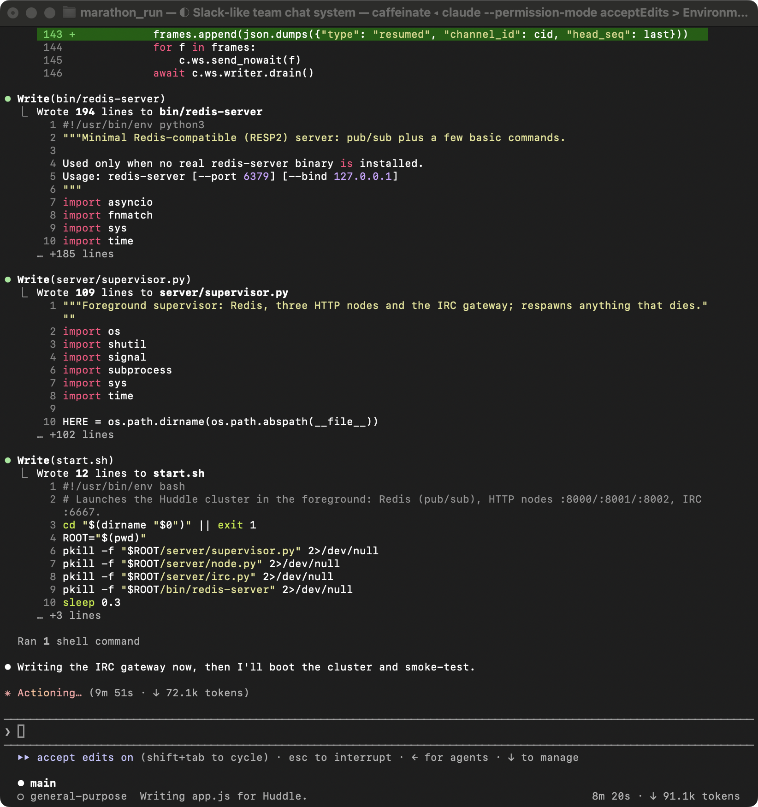

# Design

The tool has two components. Both read one thing: the lines you wrote at init, in your words.

## Component 1: alignment flags

At init you answer five questions. Answers to q1, q2 and q3 become lines that every later decision is
judged against, and they are injected into the agent's first prompt. Two events trigger a judgement:
a delegation, caught by a PreToolUse hook on the Task tool before any work exists, and a subagent's
own Bash, Write or Edit call, caught by a second PreToolUse hook. The action hook first runs a
keyword filter against your lines and skips the judge when nothing overlaps, so most tool calls cost
nothing. What reaches the judge is your lines, the brief or the command, and the state of the parent
that issued it. The judge returns a verdict, a confidence, and evidence pairs that quote your line
against the text that conflicts with it. Confidence selects the band: at 0.85 and above a departure
holds the spawn and asks you, between 0.50 and 0.65 or when no line covers the case you get one line
and nothing pauses, and everything else is recorded with no notice. A subagent's own action holds
only at 0.85 and above, and the orchestrator's own actions are recorded but never blocked. If you
accept more than 30 percent of recent holds, holds become checks until that recovers.

## Component 2: catch-up

Catch-up counts what you have not seen and tells you once it passes your threshold. The count is
departures that were never shown, plus checks you did not answer, plus repeats of a decision you
declined at double weight, plus one point per ten files written in nodes you have not opened, plus
subagents that finished while you were away. Your answer to q5 sets the threshold at 3, 5 or 8. The
count is taken when a subagent finishes, which is a seam in the work rather than an interruption of
it. The line is delivered on the next tool result, because Claude Code does not display output from
the SubagentStop hook. Nothing is paused by catch-up, and any look at the graph resets the count to
zero.

## What the terminal shows, and what the graph shows

| | terminal | graph |
|---|---|---|
| a decision that fits | nothing | a mark on the node |
| a check | one line, nothing paused | an item you can answer later |
| a hold | the evidence, three choices, the agent waits | opens on that node |
| catch-up | one line with the counts | the items behind those counts |
| your lines | `ctl.py lines` | listed under the items |

The graph opens by itself only on a hold. A check carries a link. A fit shows neither.

## Screenshots

The session running with the overlay in place:

The graph after a run. Two nodes, the lines you wrote, nothing waiting:

One node opened. What it owns, the decision that started it, what it did that departed, and a count
of the rest:

## Run it on a SWE Marathon task

1. Make a task directory and put the task instruction in it as `PROMPT.md`.
2. Copy the overlay into it: `cp -R overlay/.claude overlay/oversight <task dir>/`.
3. Answer the five questions: `python3 oversight/ctl.py init`. Several rules in one answer can be
   separated with semicolons. Check them with `python3 oversight/ctl.py lines`.
4. Start the viewer: `python3 oversight/viewer/serve.py 4173`. Leave the tab closed.
5. Start the agent: `claude --permission-mode acceptEdits "$(cat PROMPT.md)"`.
6. Answer holds in the terminal as they appear. Everything else needs nothing from you.
7. During or after the run: `ctl.py status`, `ctl.py judgements`, `ctl.py catchup`, `ctl.py lines`.

Every judgement is written to `oversight/judgements/`, every event to `oversight/events.jsonl`, and
every answer to `oversight/control/interventions.jsonl`.
